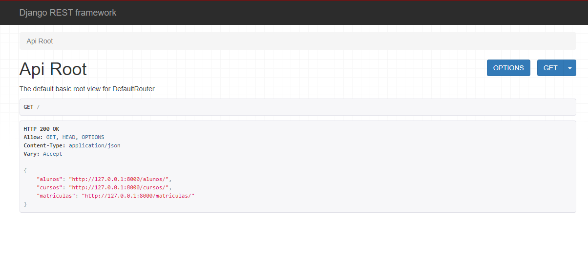

# API 

]

Projeto construído para o cadastro em um banco de dados de uma escola.

🔗[Clique aqui para acessar](https://tamireespaiva.github.io/NLW-Esportes/)

## 🎮 Tecnologias 

- Django Rest
- Python
- SQL (sqlite)
- Git e GitHub

## 📱 Contato

tamires.paiva@outlook.com

